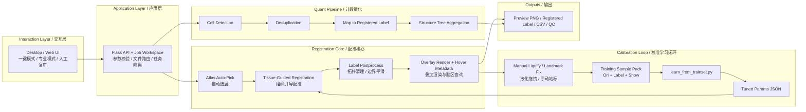

# Brainfast

Brainfast 是一个面向真实实验流程的脑图谱配准与细胞计数工作区。

它不是单纯的“把 atlas 叠上去”的演示工具，而是一条完整链路：
Allen 图谱自动选层 -> 配准与人工复审 -> 校准样本沉淀 -> 自动学习 -> 全脑细胞计数与 QC 导出。

Brainfast is a practical workspace for Allen atlas alignment, manual correction, calibration learning, and whole-brain cell counting.

## Start Here / 从这里开始

如果你是第一次打开这个仓库，建议按这个顺序：

1. 看完整说明：[project/README.md](project/README.md)
2. 先做环境检查：
   ```bash
   cd project
   python scripts/check_env.py --config configs/run_config.template.json
   ```
3. 启动界面：
   ```bash
   cd project/frontend
   python server.py
   ```
4. 浏览器打开：`http://127.0.0.1:8787`

## Architecture / 架构图



## What You’ll Find / 你会在这里看到什么

- [project/README.md](project/README.md)
  - 完整使用说明
  - 新架构说明
  - UI / CLI 启动方式
  - 校准学习闭环
  - 输出文件解释
  - 回归测试命令
- `project/scripts/`
  - 配准、渲染、映射、聚合、训练、测试主逻辑
- `project/frontend/`
  - Flask 服务、网页 UI、桌面打包入口

## Current Status / 当前状态

当前版本已经从“研究原型”推进到“可验证、可继续开发的工程原型”：

- 结果链路比之前更可信，去掉了伪映射和伪层级统计
- 训练闭环已改成 `Label.tif` 真值优先
- 增加了最小回归测试
- 预览与人工校准路径已支持 `jobId` 隔离

但它还不是完全成型的云端多用户系统。更完整的模块化和任务队列仍然在后续演进范围内。

## Large Local Artifacts / 未纳入版本管理的大体积内容

- `Samples/`: microscope sample data
- `repos/`: third-party upstream repository
- `project/frontend/build`, `project/frontend/dist`: desktop build artifacts

## License / 许可证

This project is licensed under the GNU Affero General Public License v3.0 (AGPL-3.0).

本项目采用 GNU Affero General Public License v3.0（AGPL-3.0）许可证。

See [LICENSE](LICENSE) for details.
