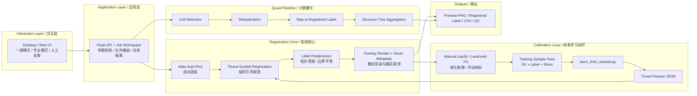

# Brainfast

Brainfast 是一个面向真实实验流程的脑图谱配准与细胞计数工作区。

它不是单纯的“把 atlas 叠上去”的演示工具，而是一条完整链路：
Allen 图谱自动选层 -> 配准与人工复审 -> 校准样本沉淀 -> 自动学习 -> 全脑细胞计数与 QC 导出。

Brainfast is a practical workspace for Allen atlas alignment, manual correction, calibration learning, and whole-brain cell counting.

## Install / 安装

```bash
python -m venv .venv && .venv\Scripts\activate
pip install -e ".[dev]"               # minimal 2D (no Cellpose, no ANTs)
pip install -e ".[advanced,dev]"      # + Cellpose GPU detection
pip install -e ".[wholebrain,dev]"    # + ANTs 3D registration
pip install -e ".[full,dev]"          # everything
```

## Start Here / 从这里开始

如果你是第一次打开这个仓库，建议按这个顺序：

1. 看完整说明：[project/README.md](project/README.md)
2. 先做环境检查：
   ```bash
   cd project
   python scripts/check_env.py --config configs/run_config.template.json
   ```
3. 启动界面：
   ```bash
   cd project/frontend
   python server.py
   ```
4. 浏览器打开：`http://127.0.0.1:8787`

## Architecture / 架构图


```mermaid
flowchart LR
  subgraph UI["Interaction Layer / 交互层"]
    A["Desktop / Web UI<br/>一键模式 / 专业模式 / 人工复审"]
  end

  subgraph APP["Application Layer / 应用层"]
    B["Flask API + Job Workspace<br/>参数校验 / 文件路由 / 任务隔离"]
  end

  subgraph REG["Registration Core / 配准核心"]
    C["Atlas Auto-Pick<br/>自动选层"]
    D["Tissue-Guided Registration<br/>组织引导配准"]
    E["Label Postprocess<br/>拓扑清理 / 边界平滑"]
    F["Overlay Render + Hover Metadata<br/>叠加渲染与脑区查询"]
  end

  subgraph LEARN["Calibration Loop / 校准学习闭环"]
    G["Manual Liquify / Landmark Fix<br/>液化拖拽 / 手动地标"]
    H["Training Sample Pack<br/>Ori + Label + Show"]
    I["learn_from_trainset.py"]
    J["Tuned Params JSON"]
  end

  subgraph COUNT["Quant Pipeline / 计数量化"]
    K["Cell Detection"]
    L["Deduplication"]
    M["Map to Registered Label"]
    N["Structure Tree Aggregation"]
  end

  subgraph OUT["Outputs / 输出"]
    O["Preview PNG / Registered Label / CSV / QC"]
  end

  A --> B
  B --> C --> D --> E --> F --> O
  F --> G --> H --> I --> J --> D
  B --> K --> L --> M --> N --> O
```

## What You’ll Find / 你会在这里看到什么

- [project/README.md](project/README.md)
  - 完整使用说明
  - 新架构说明
  - UI / CLI 启动方式
  - 校准学习闭环
  - 输出文件解释
  - 回归测试命令
- [REPRODUCE.md](REPRODUCE.md)
  - 5 步端到端复现说明
  - 软件级最小复现 + 本地样本复现实例
- [CITATION.cff](CITATION.cff)
  - 标准软件引用元数据
- [CODE_SIGNING.md](CODE_SIGNING.md)
  - Windows desktop code-signing setup for release builds
- `project/scripts/`
  - 配准、渲染、映射、聚合、训练、测试主逻辑
- `project/frontend/`
  - Flask 服务、网页 UI、桌面打包入口

## Current Status / 当前状态

当前版本已经从“研究原型”推进到“可验证、可继续开发的工程原型”：

- Whole-brain automatic runs now use the native 3D volume-first truth path (`miki_3d`).
- Key 3D artifacts include `outputs/volume/input_volume.nii.gz`, `outputs/template_prep/template_half.nii.gz`, `outputs/template_prep/annotation_half.nii.gz`, `outputs/ants_registration/ants_result.nii.gz`, `outputs/ants_registration/annotation_registered.nii.gz`, `outputs/laplacian_refinement/final_registered.nii.gz`, `outputs/truth_export/slice_*_registered_label.tif`, `outputs/truth_export/slice_*_overlay.png`, `outputs/slice_registration_qc.csv`, and `outputs/volume_registration_qc.csv`.
- The 2D workflow remains available for preview and manual correction only.
- 结果链路比之前更可信，去掉了伪映射和伪层级统计
- 训练闭环已改成 `Label.tif` 真值优先
- 增加了最小回归测试
- 预览与人工校准路径已支持 `jobId` 隔离

但它还不是完全成型的云端多用户系统。更完整的模块化和任务队列仍然在后续演进范围内。

## Trust Policy / 信任策略

Hard rules for interpreting Brainfast outputs. These apply to all users and all samples.

1. **Do not trust region-level counts when registration overlays are visibly poor.**
   If the atlas overlay does not match the tissue anatomy, downstream cell-to-region mapping is meaningless regardless of how good the detector is. Always verify registration quality before interpreting count tables.

2. **Do not use Cellpose quality as a scapegoat for atlas-mapping failures before registration is verified.**
   Cell detection and atlas registration are independent quality dimensions. A region showing zero counts may mean the detector missed cells, or it may mean the atlas label for that region was never placed on the tissue. Check registration first.

3. **Do not expand sample coverage until at least one sample has completed a user-visible manual workflow.**
   The current interactive workflow (load -> register -> correct -> detect -> export) is not yet completable end-to-end from the UI. Until it is, broad sample rollout will produce results that cannot be validated by the user.

For detailed gap analysis, see:
- [`docs/superpowers/plans/interactive-workflow-gap-audit.md`](docs/superpowers/plans/interactive-workflow-gap-audit.md)
- [`docs/superpowers/plans/registration-failure-taxonomy.md`](docs/superpowers/plans/registration-failure-taxonomy.md)

## Cellpose-SAM (`cpsam`) Integration

Brainfast uses the **Cellpose** Python package (v4+) for cell detection. The default model is `cpsam` — Cellpose's built-in SAM-augmented model accessed via `cellpose.models.CellposeModel(pretrained_model="cpsam")`.

Key points:
- There is **no separate `segment-anything` or SAM2 runtime** in this repo. The SAM component is internal to Cellpose.
- Set `detection.primary_model` to `"cpsam"` in your run config. Other supported values: any Cellpose built-in model name, or `"log"` for the fallback Laplacian-of-Gaussian detector.
- GPU inference is enabled by default (`detection.cellpose_gpu: true`). For large images, the pipeline automatically tiles to prevent OOM via `bsize`.
- `Save Calibration + Learn` in the UI tunes atlas overlay parameters — it does **not** retrain or fine-tune Cellpose-SAM.
- If Cellpose is not installed, the pipeline falls back to the LoG detector with a warning.

Install: `pip install -e ".[advanced]"` (includes Cellpose + SimpleITK).

## Large Local Artifacts / 未纳入版本管理的大体积内容

- `Samples/`: microscope sample data
- `repos/`: third-party upstream repository
- `project/frontend/build`, `project/frontend/dist`: desktop build artifacts

## License / 许可证

This project is licensed under the GNU Affero General Public License v3.0 (AGPL-3.0).

本项目采用 GNU Affero General Public License v3.0（AGPL-3.0）许可证。

See [LICENSE](LICENSE) for details.
