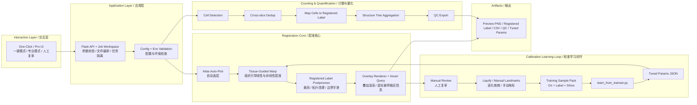

# Brainfast / 脑图谱配准、人工校准与细胞计数工具

## Overview / 项目定位

Brainfast 解决的是一个很具体的问题：
把真实显微切片和 Allen atlas 对齐，并在“能人工复审、能持续学习、能产出统计表”的前提下完成整套工作流。

如果你只想快速跑起来，看下面的“3 分钟开始”。

如果你准备继续开发，看“架构图”“项目结构”“当前边界”这几个部分。

Brainfast is a practical workflow for atlas alignment, manual correction, calibration learning, and whole-brain cell counting from microscopy TIFF data.

## Why This Repo Exists / 这个仓库是干什么的

- 不只是做一张叠加图，而是要把结果走到 `CSV + QC + 可复核样本`
- 不只追求“看起来对齐”，还要让脑区映射和层级统计尽量可信
- 不把人工修正浪费掉，而是沉淀成训练样本继续改进参数

## Architecture / 新架构图



## How To Read This Architecture / 这张图该怎么理解

- 左边是你看到的界面。你点按钮，不是直接改算法，而是先进入 Flask 服务层。
- 中间是两条主链路：
  - 配准链：自动选层 -> 配准 -> 标签清理 -> 叠加预览
  - 计数链：检测 -> 去重 -> 映射 -> 聚合 -> QC
- 上面那条回路是“人工修正不会白做”的核心：
  - 你液化或手动打点修正后的结果，会保存成 `Ori + Label + Show`
  - 后续训练脚本优先用 `Label.tif` 学习，而不是学 UI 颜色线条
- 输出层不只是一张图，而是整套可追溯结果：预览图、注册标签、统计表、QC、调参结果

## 3-Minute Start / 3 分钟开始

### A. 推荐：先做环境检查

```bash
cd project
python scripts/check_env.py --config configs/run_config.template.json
```

如果你准备跑真实批处理，可以加：

```bash
python scripts/check_env.py --config configs/run_config.template.json --require-input-dir
```

### B. 启动图形界面

```bash
cd frontend
python server.py
```

浏览器打开：`http://127.0.0.1:8787`

### C. 命令行最小跑通

```bash
cd project
python scripts/main.py --config configs/run_config.template.json --make-sample-tiff outputs/sample_input
python scripts/main.py --config configs/run_config.template.json --run-real-input outputs/sample_input
```

## Which Mode Should I Use? / 我该选哪种模式

| 场景 | 推荐模式 | 为什么 |
| --- | --- | --- |
| 第一次接触项目，只想先把流程跑通 | 一键模式 | 参数少，能更快看到结果 |
| 已经知道 atlas、切片、配准策略要怎么调 | 专业模式 | 可以完整控制路径、参数和显示方式 |
| 自动配准接近正确，但边界还有局部偏差 | 人工复审 + Liquify | 修局部边界最快 |
| 关键脑区边界偏差明显，需要明确控制对应点 | 手动地标 | 比液化更适合结构级纠偏 |

## Typical Workflow / 推荐操作流程

### 如果你是实验使用者

1. 先填 `real slice`、`atlas annotation`、`structure CSV`
2. 点击 `Auto Pick`，让系统先找到最可能的 atlas 切片
3. 点击 `Refresh Preview`，看初始叠加效果
4. 如果自动结果还行，直接做 `AI Landmark Registration`
5. 如果边界局部不顺，进入人工复审：
   - 小范围边界修正，用 `Liquify`
   - 明确对应点修正，用 `Manual Landmarks`
6. 点击 `Save Calibration + Learn`
7. 跑整批计数，最后看 `cell_counts_leaf.csv`、`cell_counts_hierarchy.csv`、`slice_registration_qc.csv`

### 如果你是开发者

1. 先跑环境检查
2. 用 UI 或 CLI 复现一个最小样例
3. 先看 `outputs/slice_registration_qc.csv`
4. 再看注册标签和统计表有没有偏差
5. 改算法后跑回归测试，避免把现有链路打坏

## What Each Important Button Does / 几个关键按钮到底在做什么

| 按钮 | 背后做的事 |
| --- | --- |
| `Auto Pick` | 在 `annotation_25.nii.gz` 里挑最接近当前真实切片的 atlas 层 |
| `Refresh Preview` | 读取真实切片和 atlas 标签，完成配准、标签后处理、叠加渲染 |
| `AI Landmark Registration` | 基于自动或手动点对做进一步对齐 |
| `Liquify` | 直接在当前已对齐标签上做局部形变微调 |
| `Save Calibration + Learn` | 把人工修正固化成训练样本，并触发自动调参 |
| `Run Pipeline` | 跑整套检测、去重、脑区映射、层级聚合和 QC 导出 |

## Calibration Learning Loop / 校准学习闭环

### Training Sample Format / 训练样本格式

- `N_Ori.png`
  - 原始真实切片的显示图
- `N_Label.tif`
  - 人工确认后的真实标签真值
- `N_Show.png`
  - 给人看的预览叠加图，主要用于兼容旧样本和人工检查

### Why This Matters / 为什么要这样设计

旧做法容易学到 UI 颜色和边界线，而不是学到“真实修正后的标签”。

现在训练器会优先读取 `Label.tif`，只有旧样本没有标签时才回退到 `Show.png`。

### Tuning Command / 调参命令

```bash
cd project
python scripts/learn_from_trainset.py --train-dir train_data_set --annotation annotation_25.nii.gz --out-json outputs/trainset_tuned_params.json
```

如果参数很多，也可以在 PowerShell 里自行换行。

## Main Outputs / 你最关心的输出

| 文件 | 用途 |
| --- | --- |
| `outputs/overlay_preview.png` | 当前预览叠加图 |
| `outputs/overlay_label_preview.tif` | 当前预览对应的注册标签 |
| `outputs/cells_detected.csv` | 原始检测结果 |
| `outputs/cells_dedup.csv` | 去重后的细胞结果 |
| `outputs/cells_mapped.csv` | 带脑区映射信息的细胞结果 |
| `outputs/cell_counts_leaf.csv` | 叶子脑区统计 |
| `outputs/cell_counts_hierarchy.csv` | 层级脑区统计 |
| `outputs/slice_qc.csv` | 切片级基础 QC |
| `outputs/slice_registration_qc.csv` | 每张切片的自动选层 / 配准质量 / 耗时记录 |
| `outputs/trainset_tuned_params.json` | 自动学习得到的参数 |
| `outputs/manual_calibration/` | 手工校准历史样本 |

### About Job Isolation / 关于 job 隔离

预览、液化、人工校准相关输出已经支持按 `jobId` 写入：

- 默认仍可使用 `outputs/`
- 当 UI 带上 `jobId` 时，会写到 `outputs/jobs/<jobId>/`

这样至少能避免多个预览会话互相覆盖同一张 `overlay_preview.png`。

## Repository Layout / 仓库结构

| 路径 | 说明 |
| --- | --- |
| `configs/` | 运行配置、Allen 结构树与结构元数据 |
| `scripts/` | 配准、渲染、映射、聚合、训练、测试脚本 |
| `frontend/` | Flask 服务、网页 UI、桌面打包 |
| `outputs/` | 运行结果、调参结果、QC 导出 |
| `train_data_set/` | 用于自动学习的样本库 |
| `tests/` | 当前最小回归测试集 |

## Validation & Regression Tests / 验证与回归

### 环境检查

```bash
cd project
python scripts/check_env.py --config configs/run_config.template.json
```

### 最小回归测试

```bash
cd project
python -m unittest discover -s tests -v
```

### 调参后批量对比测试

```bash
cd project
python -m scripts.run_overlay_test --real "<real_c1.tif>" --real "<real_c0.tif>" --annotation "annotation_25.nii.gz" --outputs-root "outputs" --tuned-params-json "outputs/trainset_tuned_params.json"
```

## Current Boundaries / 当前边界与诚实说明

这部分很重要，避免你把它误判成“已经完全云端化的成熟产品”。

### 当前已经比较可靠的部分

- 配准预览主链路
- 注册后标签直接映射到脑区
- 基于 Allen 真实结构树的层级聚合
- `Label.tif` 优先的训练闭环
- 最小回归测试与切片级耗时记录

### 当前仍然偏弱的部分

- Flask 服务层仍然偏大，`server.py` 还需要进一步拆分
- `overlay_render.py` 已拆出一部分，但注册核心仍然不够轻
- 批处理运行状态和自动学习状态还不是正式 job queue
- 目前更适合单机研究工作流，不建议直接当成完整云端多用户系统

## Troubleshooting / 常见问题

### 1. 预览失败

先检查：

- `realPath` 是否存在
- `labelPath` 或 `annotation_25.nii.gz` 是否存在
- `structure CSV` 是否可读
- `python scripts/check_env.py --config ...` 是否通过

### 2. 自动选层结果不理想

- 确认 `pixel_size_um_xy` 是否正确
- 先尝试切换切片面或检查真实切片是否选对 Z
- 看 `slice_registration_qc.csv` 里的 `best_score`

### 3. 叠加图“看着还行”，但统计不放心

不要只看 PNG。

请同时检查：

- `overlay_label_preview.tif`
- `cells_mapped.csv`
- `cell_counts_leaf.csv`
- `cell_counts_hierarchy.csv`

### 4. 学习效果不稳定

- 先确认训练样本里有没有 `*_Label.tif`
- 检查样本是不是都集中在同一种切片形态
- 不要把明显失败的人工校准结果直接收进训练集

## Additional Docs / 其他文档

- [frontend/README.md](frontend/README.md): 前端启动与桌面打包说明
- `ATLAS_OVERLAY_GUIDE.md`: 简洁操作清单
- `USER_MANUAL.md`: 更详细的中文使用手册

## License / 许可证

Brainfast is released under GNU AGPL-3.0.

Brainfast 采用 GNU AGPL-3.0 许可证发布。

See [`../LICENSE`](../LICENSE) for full text.

---

Last updated / 最后更新: 2026-03-13
